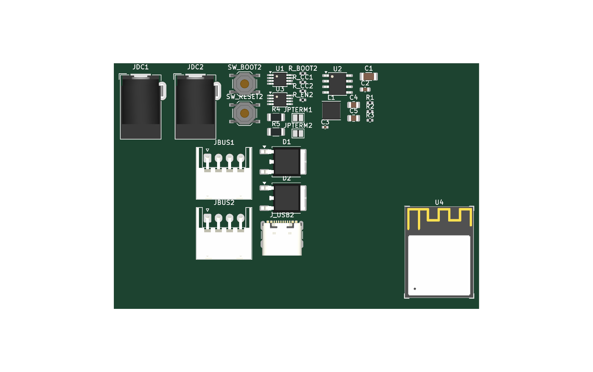
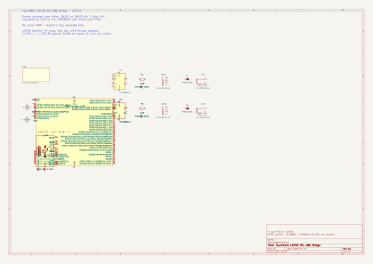
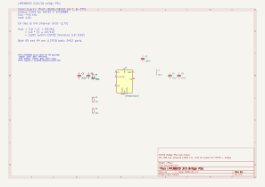
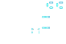
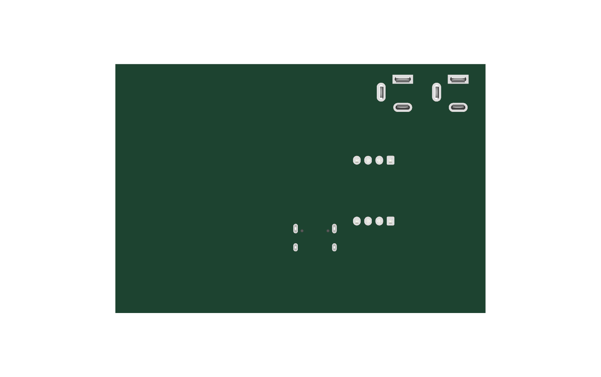

# Tsumikoro ESP32 RS-485 Bridge — Hardware

4-layer PCB acting as a dual-bus gateway between two independent
Tsumikoro RS-485 segments and a user-supplied ESP32-DevKitC-V4 module.
Each bus has its own SIT3088E transceiver, its own JST-XH connector,
its own DC barrel jack for direct power injection (with Schottky
reverse-polarity protection), and its own solder-jumper-enabled 120 Ω
end-of-line termination. Board regulates incoming V+ to 3.3 V via an
LMR38020 synchronous buck for the ESP32.

Target manufacturing: **JLCPCB 4-layer (JLC04161H)**, Standard assembly
(includes through-hole connectors + ESP32 headers).



## Block overview

| Block | Part | Notes |
|-------|------|-------|
| MCU module | **ESP32-S3-MINI-1-N8** (LCSC C2913206) | Soldered directly; native USB 2.0 on GPIO19/20, 8 MB flash, PCB antenna |
| USB-C | USB-TYPE-C-019 (LCSC C2927039) | 16-pin standard receptacle for programming + optional 5 V power; `Connector_USB:USB_C_Receptacle_GCT_USB4085` footprint (3D model available) |
| Buttons | 2 × TS-1187A-B-A-B (LCSC C318884) | BOOT + RESET tact switches |
| CC resistors | 2 × 5.1 kΩ 0402 (C25905) | USB-C sink-device marking on CC1 / CC2 |
| Strapping | R_EN 10k, R_BOOT 10k (C25744, BASIC) | Pull-ups on EN and GPIO0 |
| RS-485 transceivers | 2 × SIT3088EEUA (MSOP-8) | U1 for Bus 1, U3 for Bus 2 — each on its own ESP32 UART |
| Terminations | 2 × 120 Ω 1206 + solder jumper | `R4`/`JPTERM1` for Bus 1, `R5`/`JPTERM2` for Bus 2 — close the jumper at each bus endpoint |
| 3.3 V PSU | LMR38020SDDAR (SOIC-8-EP) | 3.8–80 V in, 2 A out — see `psu.kicad_sch` |
| Inductor | FNR4030S 10 µH, 4×4 mm | PSU buck inductor |
| Bus connectors | 2 × JST-XH 4-pin RA | JBUS1, JBUS2 — each serves a **separate** RS-485 segment |
| DC power jacks | 2 × DC-005K-5A-2.0 (C2880546) | JDC1, JDC2 — optional wall-wart input per bus |
| Reverse polarity | 2 × MBRD10200 (DPAK, 10 A/200 V) | D1 in line with JDC1→Bus 1 V+; D2 for Bus 2 |
| Power source | Either/both JBUS V+ rails **or** either/both DC jacks | Diodes OR the sources per bus |

## Power architecture

```
  JDC1 (DC barrel) ── D1 (MBRD10200) ──┐
                                        ├── JBUS1 V+ (Bus 1 supply rail)
  JBUS1 pin 1 ──────────────────────────┘
                                               │
                                               ├── LMR38020 VIN (via wire-OR with JBUS2 V+)
                                               │                     │
  JDC2 (DC barrel) ── D2 (MBRD10200) ──┐       │                     ▼
                                        ├── JBUS2 V+ (Bus 2 supply rail)
  JBUS2 pin 1 ──────────────────────────┘       │
                                               │      ┌──► +3V3 to ESP32 3V3 pin
                                               └──────┤
                                                      └──► SIT3088E VCC for U1, U3

  Bus data (per bus):
      JBUS1 A/B ──► U1 (SIT3088E) ──► ESP32 UART1
      JBUS2 A/B ──► U3 (SIT3088E) ──► ESP32 UART2
      R4 + JPTERM1 = 120 Ω series-jumper termination at Bus 1 endpoint
      R5 + JPTERM2 = 120 Ω series-jumper termination at Bus 2 endpoint
```

Each bus is **electrically independent** — they share only the ESP32, the
3.3 V rail, and GND. This lets the ESP32 act as a protocol gateway, a
packet switch, or bridge two different bus speeds/topologies. Power can
be injected on either bus (via DC jack or upstream bus connector) and
the LMR38020 pulls whichever rail is highest. The Schottkys prevent
one bus from back-feeding the other or the DC jacks from back-feeding
each other.

The LMR38020 feedback divider is retuned for 3.3 V:

- Vref (typ): 1.0 V
- R2 (top) = **22 kΩ 0402 (basic, C25768)**
- R3 (bottom) = **10 kΩ 0402 (basic, C25744)**
- Vout = 1.0 × (1 + 22 / 10) = **3.20 V** (within ESP32 tolerance 3.0–3.6 V)

## Recommended ESP32 pinout

Two independent RS-485 buses need two UARTs plus a DE/~RE control line
each. The ESP32-S3 has a fully programmable UART matrix — any GPIO can
serve any UART. UART0 is used for USB serial (ROM bootloader / console
fallback), leaving UART1 and UART2 for the RS-485 channels.

Native USB 2.0 lives on GPIO 19 (D-) and GPIO 20 (D+) — those go to
the USB-C receptacle (J_USB) directly, no USB-UART chip required.

| Signal | ESP32-S3 GPIO | Wire to | Notes |
|--------|---------------|---------|-------|
| **Bus 1 — UART1** |  |  |  |
| U1 TX | GPIO 17 | U1 pin 4 (DI) |  |
| U1 RX | GPIO 16 | U1 pin 1 (RO) |  |
| Bus 1 DE/~RE | GPIO 4 | U1 pin 3 (DE) + pin 2 (~RE) | Tie DE+~RE together; high = drive, low = receive |
| **Bus 2 — UART2** |  |  |  |
| U2 TX | GPIO 15 | U3 pin 4 (DI) |  |
| U2 RX | GPIO 14 | U3 pin 1 (RO) |  |
| Bus 2 DE/~RE | GPIO 7 | U3 pin 3 (DE) + pin 2 (~RE) |  |
| **USB (native, no external chip)** |  |  |  |
| USB D- | GPIO 19 | J_USB D- (A7 / B7 tied) |  |
| USB D+ | GPIO 20 | J_USB D+ (A6 / B6 tied) |  |
| **Power / strapping** |  |  |  |
| VCC | 3V3 | Decouple with 10 µF + 100 nF near U4 |  |
| EN | via R_EN 10 kΩ to 3V3, also to SW_RESET | Low = reset | 100 nF filter cap to GND optional |
| GPIO 0 | via R_BOOT 10 kΩ to 3V3, also to SW_BOOT | Hold low during reset to enter DFU | Used by esptool auto-reset |
| GND | — | Large plane / 65-pin module thermal pad |  |

**Avoid on ESP32-S3 (don't use as application GPIOs):**

- **GPIO 0, 3, 45, 46** — boot strapping pins
- **GPIO 19, 20** — native USB D-/D+ (reserved for J_USB)
- **GPIO 26–32** — internal SPI flash on most ESP32-S3 modules
- **GPIO 33–37** — reserved for octal PSRAM on S3R8 variants (S3-MINI-1-N8 doesn't have PSRAM, so these are free on this module but still treat as if reserved if you ever swap to an -R8 variant)
- **GPIO 43, 44** — UART0 (USB-Serial-JTAG + bootloader console)

## Module variant: soldered vs DevKit-socketed

This rev uses a **soldered ESP32-S3-MINI-1-N8** module (U4). The
alternative — mounting an Espressif ESP32-S3-DevKitC-1 module into
headers — has its footprint vendored in `hardware/lib/` for future
use (`tsumikoro:ESP32-S3-DevKitC`) but isn't placed on the current
schematic.

The soldered MINI-1 variant is cheaper in volume, takes less board
area, has a proper 3D model, and needs fewer external parts (we add
our own USB-C, buttons, and strapping). The DevKit variant would drop
in as a full assembled dev board and save integration work but is
larger.

## Connectors

| Ref | Connector | Function | Pinout |
|-----|-----------|----------|--------|
| JBUS1 | JST-XH 4-pin RA | **Bus 1** — RS-485 segment A | 1: V+, 2: B, 3: A, 4: GND |
| JBUS2 | JST-XH 4-pin RA | **Bus 2** — RS-485 segment B (electrically separate) | 1: V+, 2: B, 3: A, 4: GND |
| JDC1 | DC barrel (2.0 mm center) | Bus 1 power input | Tip: V+, Sleeve: GND, Switch: NC |
| JDC2 | DC barrel (2.0 mm center) | Bus 2 power input | Tip: V+, Sleeve: GND, Switch: NC |
| J_USB | USB-C receptacle (16-pin standard) | ESP32-S3 native USB + 5 V power | pin numbering per USB-C spec |
| SW_BOOT | SMD tact switch | Hold during reset → DFU/download mode | connected between GPIO0 and GND |
| SW_RESET | SMD tact switch | System reset | pulls EN low |
| JPTERM1 | 2-pin solder jumper | Bus 1 120 Ω termination enable (series with R4) | Open by default; close at endpoint |
| JPTERM2 | 2-pin solder jumper | Bus 2 120 Ω termination enable (series with R5) | Open by default; close at endpoint |

Row-to-row spacing between J_ESP_L and J_ESP_R: **25.4 mm (1 inch)** —
matches the ESP32-DevKitC-V4 body.

## Board layout

### Schematic — root sheet



### Schematic — PSU sub-sheet (LMR38020 @ 3.3V)



### PCB — top / bottom

| Top | Bottom (mirrored) |
|-----|-------------------|
|  |  |

| 3D top | 3D bottom |
|--------|-----------|
|  |  |

## BOM

Auto-generated. Regenerate with:

```sh
cd hardware
make bom-bridge     # just the BOM
make docs-bridge    # images + BOM
```

Current BOM: [`jlcpcb_bom.csv`](../jlcpcb_bom.csv).

## Manufacturing package

```sh
cd hardware
make jlc-bridge
```

Produces `bridge-jlcpcb.zip` plus the unpacked `bridge/jlcpcb/` directory
with gerbers, merged drill, JLCPCB-format BOM, and CPL. Upload the zip to
<https://cart.jlcpcb.com/quote>.

## Design rules

Same as servo board — 4-layer JLC04161H-7628 stackup inherited from
`servo.kicad_pro`:

| Rule | Value |
|------|-------|
| Min track width | 0.15 mm |
| Min clearance | 0.15 mm |
| Min drill | 0.3 mm |
| Min via | 0.45 mm dia / 0.2 mm drill |
| Board edge clearance | 0.2 mm rule (0.5 mm recommended) |
| Stack-up | JLC04161H-7628 (1.6 mm FR4, 4 layers) |

## Status

Rev 0.1 — schematic skeleton with all ICs/connectors/passives placed, but
**wiring is pending**. The LMR38020 pinout is an informed guess and
should be verified against TI's SLUSDS8 datasheet before the first fab
run. Board outline and layout haven't been drawn yet.
