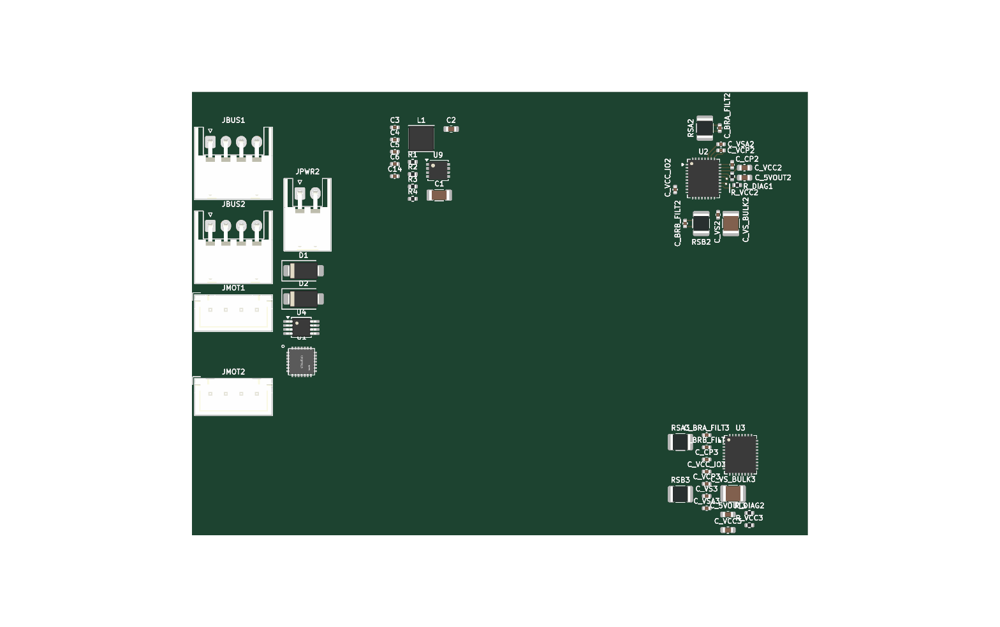

# Tsumikoro TMC2130 Dual Stepper Driver — Hardware

4-layer PCB implementing a dual-axis stepper controller node. One
STM32G0B1KBU6 MCU drives two TMC2130 stepper drivers over shared SPI,
talks to the RS-485 bus at 1 Mbaud, and accepts motor power from either
the bus V+ rail or an external JST-XH power input (diode-OR'd).

Target MCU matches `firmware/tsumikoro-ministepper/`. Target
manufacturing: **JLCPCB 4-layer (JLC04161H)**, Standard assembly.



## Block overview

| Block | Part | Notes |
|-------|------|-------|
| MCU | STM32G0B1KBU6 (UFQFPN-32) | ARM Cortex-M0+ @ 64 MHz, 64 KB flash, 36 KB RAM — same as firmware target |
| Stepper drivers | 2 × TMC2130-LA-T (QFN-36 5×6) | 2 A per phase, 46 V max, 256 microstep, shared SPI bus |
| RS-485 transceiver | SIT3088EEUA (MSOP-8) | USART2 on PA2/PA3 (no SYSCFG remap needed on G071) |
| 3.3 V logic PSU | TPS54061DRBT (VSON-8-EP) | ~150 mA load (MCU + 2× TMC VCC_IO + RS-485) — see `psu.kicad_sch` |
| Motor supply | VPP — bus V+ or external JPWR | Two SS34 Schottky diodes OR the sources |
| Bus connectors | 2 × JST-XH 4-pin RA | JBUS1, JBUS2 — daisy-chain V+/GND/A/B |
| Motor outputs | 2 × JST-XH 4-pin | JMOT1, JMOT2 — A+ A- B+ B- per bipolar stepper |
| External power | JST-XH 2-pin | JPWR — optional wall-wart for motor supply |
| Sense resistors | 0.1 Ω 1% 1210 × 4 | BRA/BRB pair per TMC, ~1.6 A RMS max |

## Power architecture

```
  JBUS1 pin 1 ─┬── D2 (SS34) ──┐
  JBUS2 pin 1 ─┘                ├── VPP (motor rail, ~5-37 V)
                                 │        │
  JPWR pin 1 ──── D1 (SS34) ─────┘        │
                                          ├── TMC VS (U2, U3) + decoupling
                                          ├── TPS54061 VIN ──► +3V3 logic
                                          │
  (all share GND)

  +3V3 ──► STM32 VDD/VDDA
      ──► TMC VCC_IO (pin 8) on both drivers
      ──► SIT3088E VCC
```

## STM32G0B1KBU6 pin map

Uses **USART2** on PA2/PA3 for RS-485 and **PA11/PA12 for USB D−/D+**.
The UFQFPN-32 package gives PA9 and PA10 as separate pins from PA11/PA12,
allowing USB and the TMC SPI/enable lines to coexist without conflict.

Authoritative pinout per EasyEDA C5159549 / ST G0B1 datasheet UFQFPN-32.
VDD and VDDA fused on pin 4. PA9/PA10 are separate pins from PA11/PA12.

| Pin | MCU           | Function           | AF / notes |
|-----|---------------|--------------------|------------|
| 1   | PB9           | Spare              | — |
| 2   | PC14/OSC32_IN | Spare              | (LSE reserve) |
| 3   | PC15/OSC32_OUT| Spare              | (LSE reserve) |
| 4   | VDD/VDDA      | 3V3 (merged)       | 100 nF + 4.7 µF bulk |
| 5   | VSS/VSSA      | GND                | |
| 6   | PF2/NRST      | Reset              | 100 nF to GND |
| 7   | PA0           | **STEP2**          | AF2 TIM2_CH1 |
| 8   | PA1           | RS-485 DE          | GPIO out |
| 9   | PA2           | USART2 TX          | AF1 → SIT3088E DI |
| 10  | PA3           | USART2 RX          | AF1 → SIT3088E RO |
| 11  | PA4           | **TMC1 CS**        | GPIO out |
| 12  | PA5           | SPI1 SCK           | AF0 — shared |
| 13  | PA6           | SPI1 MISO          | AF0 — shared |
| 14  | PA7           | SPI1 MOSI          | AF0 — shared |
| 15  | PB0           | **Limit 1**        | GPIO in, pull-up |
| 16  | PB1           | **DIAG1**          | GPIO in + 47 k pull-up |
| 17  | **PB2**       | **DRV_ENN (shared)**| GPIO out, active-low (moved from PA11) |
| 18  | PA8           | **STEP1**          | AF2 TIM1_CH1 |
| 19  | **PA9**       | **TMC2 CS**        | GPIO out (moved from PA12) |
| 20  | PC6           | **DIR2**           | GPIO out |
| 21  | PA10          | Spare              | — |
| 22  | **PA11**      | **USB D−**         | USB peripheral |
| 23  | **PA12**      | **USB D+**         | USB peripheral |
| 24  | PA13          | SWDIO              | protected |
| 25  | PA14-BOOT0    | SWCLK + BOOT0      | 10k pull-down R_BOOT0 + TP_BOOT0 |
| 26  | PA15          | **DIR1**           | GPIO out |
| 27  | PB3           | **Limit 2**        | GPIO in, pull-up |
| 28  | PB4           | **DIAG2**          | GPIO in + 47 k pull-up |
| 29  | PB5           | Status LED         | GPIO out, 1 kΩ in series |
| 30  | PB6           | I2C1 SCL           | AF6 |
| 31  | PB7           | I2C1 SDA           | AF6 |
| 32  | PB8           | Spare              | — |
| EP  | VSS           | GND (exposed pad)  | stitch vias into inner GND plane |

Independent step timers (TIM1 for axis 1, TIM2 for axis 2) allow each
axis to run at its own speed. The shared **DRV_ENN** on PB2 puts both
drivers in/out of enable together — acceptable for most motion-control
use cases where both axes are either live or shut down in sync. If you
need independent enable per axis, reclaim PB8 or PC14/PC15 and the
design still fits.

**MCU decoupling (required, to add during wiring):**
- VDD/VDDA (pin 3): 100 nF 0402 **directly at the pin** + 4.7 µF
  0603/0805 bulk within ~5 mm. A ferrite bead in series with the VDDA
  branch (before the 100 nF) is recommended if analog precision
  matters; otherwise direct tie to +3V3 is fine.
- NRST (pin 5): 100 nF 0402 to GND near the pin.

**Bootloader entry (system ROM, AN2606):** Three bootloader interfaces
are available on this package — USART2 (PA2/PA3 → RS-485 bus), I2C1
(PB6/PB7), SPI1 (PA4-PA7 shared with TMCs). To invoke, hold TP_BOOT0
to +3V3 and pulse NRST.

## Sense-resistor assembly variants

Single PCB, two BOM variants. Firmware switches via `CHOPCONF.VSENSE`:

| Variant | R_SENSE | VSENSE bit | Full-scale (CS=31) | Best for |
|---------|---------|-----------|--------------------|----------|
| **Standard** | 0.1 Ω 1% 1210 (LCSC C137091 family) | 0 | ~2.3 A RMS | NEMA17-class steppers, ≥500 mA |
| **Micro** | 0.68 Ω 1% 1210 (LCSC C3000593) | 1 | ~200 mA RMS | 28BYJ-48 (bipolar mode), micro geared steppers, 50–200 mA |

The 0.68 Ω option is placed on the schematic as **DNP** alternates next
to the 0.1 Ω standard parts; for the micro assembly, swap the DNP flag
in the BOM and firmware sets VSENSE=1.

**28BYJ-48 wiring note**: the 28BYJ-48 is a 5-wire unipolar motor. To
drive with the TMC2130 (bipolar only), leave the **red** center-tap
wire disconnected and wire Orange → A+, Yellow → A-, Pink → B+,
Blue → B- at the JMOT connector.

## TMC2130 strapping / required external parts

**This is the checklist to wire in KiCad.** For each TMC2130 (U2, U3):

| Pin | Net / part | Value / note |
|-----|-----------|--------------|
| 8 VCC_IO | 3V3 + 100 nF | logic-level supply |
| 10 SPI_MODE | 3V3 | hardware SPI mode |
| 36 TST_MODE | GND | test mode off |
| 18 DCEN, 19 DCIN | GND | dcStep unused |
| 22 DRV_ENN | MCU GPIO (EN) | software enable |
| 9 DNC, 11 N.C. | GND | unused |
| 12 GNDP, 35 GNDP2, 24 GNDA, 37 EP | GND | multiple ground pins — all tied together |
| 16 VS, 31 VSA | VPP (motor rail) + 10 µF bulk + 100 nF bypass | 4.75–46 V |
| 13–15 OB1/BRB/OB2 | motor coil B, 0.1 Ω BRB to GND | |
| 32–34 OA2/BRA/OA1 | motor coil A, 0.1 Ω BRA to GND | |
| 14 BRB, 33 BRA | 0.1 Ω 1% 1210 sense resistors to GND | + 100 nF ceramic near each |
| 28 CPI, 27 CPO | 22 nF 50V across (charge pump flying cap) | C1532 (basic) |
| 29 VCP | 100 nF 50V to VS | charge pump storage |
| 25 5VOUT | 2.2 µF 6.3V to GNDA | internal 5 V regulator |
| 26 VCC | 470 nF to GND, feed from 5VOUT via 2.2–3.3 Ω | internal digital supply |
| 23 AIN_IREF | 5VOUT through 10 k / 1 k divider, or tie to 5VOUT | current reference |
| 20 DIAG0, 21 DIAG1 | open-drain outputs, 47 k pull-ups to 3V3 | stall/fault |
| 1 CLK | GND | use internal 12 MHz clock |

Sense resistor sizing: `I_rms = V_fs / (R_sense × √2) × (CS+1)/32`.
With default V_fs = 0.325 V, R_sense = 0.1 Ω, CS = 31: **I_rms ≈ 2.3 A**
(exceeds TMC2130's 1.4 A continuous rating — always run with CS reduced
in firmware unless the motor is actively cooled).

## Connectors

| Ref | Connector | Function | Pinout |
|-----|-----------|----------|--------|
| JBUS1, JBUS2 | JST-XH 4-pin RA | RS-485 daisy-chain | 1: V+, 2: B, 3: A, 4: GND |
| JMOT1 | JST-XH 4-pin | Stepper motor 1 | 1: A+, 2: A-, 3: B+, 4: B- |
| JMOT2 | JST-XH 4-pin | Stepper motor 2 | same |
| JPWR | JST-XH 2-pin RA | External motor supply | 1: V+, 2: GND |

## Design rules

Inherited from the servo board's `servo.kicad_pro`:

| Rule | Value |
|------|-------|
| Min track width | 0.15 mm |
| Min clearance | 0.15 mm |
| Min drill | 0.3 mm |
| Min via | 0.45 mm / 0.2 mm drill |
| Stack-up | JLC04161H-7628 (1.6 mm FR4, 4 layers) |
| Board edge clearance | 0.2 mm rule (0.5 mm recommended) |

## Sheet architecture

```
ministepper.kicad_sch             (root)
├── psu.kicad_sch                 (TPS54061 3.3V PSU, one instance)
├── stepper_channel.kicad_sch     (TMC2130 + 13 passives, instance "Stepper 1")
└── stepper_channel.kicad_sch     (same file, instance "Stepper 2")
```

`stepper_channel.kicad_sch` is a **reusable sub-sheet** — you draw one
TMC2130 channel (driver + all its support passives, sense resistors,
charge pump, DIAG pull-up, decoupling, strapping ties) once, and the
root sheet instantiates it twice. KiCad automatically assigns unique
reference designators per instance (first instance's components get one
set of numbers, second instance's get another).

### Hierarchical ports exposed by `stepper_channel.kicad_sch`

| Port | Direction | Purpose |
|------|-----------|---------|
| SCK  | in  | SPI clock — shared across both channels |
| MOSI | in  | SPI data out (from MCU) — shared |
| MISO | out | SPI data in (to MCU) — shared on the bus |
| DRV_ENN | in | active-low driver enable — shared on this board |
| CS   | in  | per-channel chip select (TMC1_CS or TMC2_CS) |
| STEP | in  | per-channel step pulse |
| DIR  | in  | per-channel direction |
| DIAG1 | out | per-channel stall/fault (open-drain + 47 k pull-up) |
| MOT_A+, MOT_A-, MOT_B+, MOT_B- | out | bipolar motor phases to the motor connector |

Power nets (`+3V3`, `VPP`, `GND`) are **global** — the sub-sheet
references them via power symbols, no hierarchical port needed.

## Status

**rev 0.1 — skeleton with reusable channel.** All primary ICs,
connectors, power-source diodes, and one complete set of per-channel
TMC support passives (in `stepper_channel.kicad_sch`) are placed. The
root schematic shows the two stepper channel instances plus the PSU
sub-sheet. **Wiring (both within the sub-sheet and between sub-sheet
and root) is pending** — to be drawn in KiCad.

## Regeneration

```sh
cd hardware
make docs-ministepper     # schematic SVGs, PCB SVGs, 3D renders, BOM
make jlc-ministepper      # full JLCPCB fab/assembly package
```
