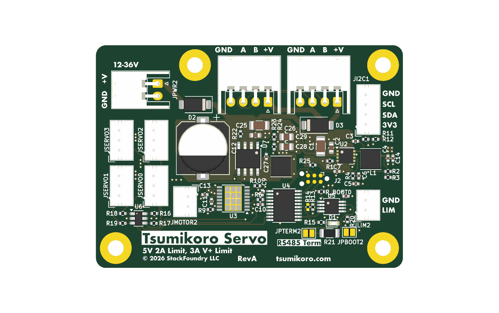
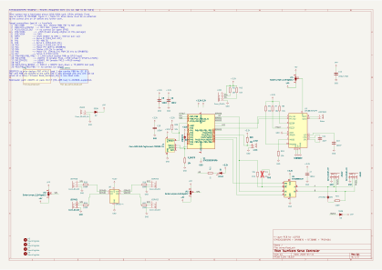
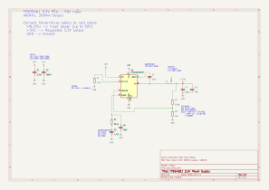
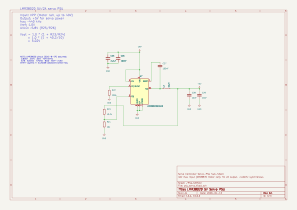
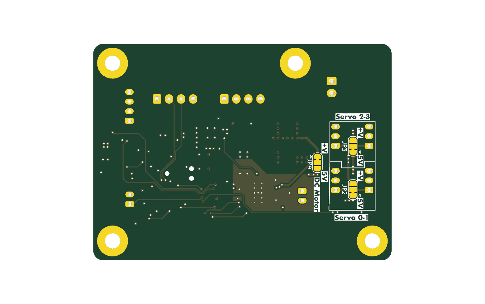

# Tsumikoro Servo Controller — Hardware

4-layer PCB implementing the Tsumikoro servo/motor controller node. One
STM32G030F6P6 MCU drives four hobby-servo outputs, one DRV8876 H-bridge motor
channel, talks to the RS-485 bus at 1 Mbaud, and exposes an I²C expansion port.

Target manufacturing: **JLCPCB 4-layer (JLC04161H)**, Standard assembly.



## Block overview

| Block | Part | Notes |
|-------|------|-------|
| MCU | STM32G030F6P6 (TSSOP-20) | ARM Cortex-M0+ @ 64 MHz, 32 KB flash |
| RS-485 transceiver | SIT3088EEUA (MSOP-8) | 1 Mbaud, half-duplex, on USART1 |
| Motor driver | DRV8876PWPR (HTSSOP-16-EP) | 3.5 A H-bridge, 4.5–37 V, PH/EN mode |
| 3.3 V logic PSU | TPS54061DRBT (VSON-8-EP) | ~50 mA logic load, 60 V Vin capable — see `psu.kicad_sch` |
| 5 V servo PSU | LMR38020SDDAR (SOIC-8-EP) | 2 A synchronous, up to 80 V Vin — see `psu_servo.kicad_sch` |
| ESD protection | SRV05-4 (SOT-23-6) | 4-channel clamp on servo outputs |
| Reverse polarity | D2 — SS36 (SMA) | Schottky on JPWR input → VPP |
| Bus isolation   | D3 — SS36 (SMA) | Schottky on VPP → bus V+ (prevents back-powering other nodes) |
| Rail select     | JP2, JP3, JP4 (3-pin solder jumpers) | Per-pair 5 V ↔ VPP selection — see power architecture |
| RS-485 termination | JPTERM2 (2-pin solder jumper) + 120 Ω 1206 | Series jumper enables bus termination at end-of-line |
| Bulk | 220 µF 50 V SMD (Lelon RVT) | Motor-rail bulk near DRV8876 |
| Status | Red LED 0603 | Driven from PA5 |

## Power architecture

```
  JPWR ─► D2 (SS36) ──┬── VPP (motor rail, after reverse-polarity drop)
                      ├── DRV8876 VM (pin 11)
                      ├── C12 bulk (220 µF / 50 V)
                      ├── TPS54061 VIN ──► psu.kicad_sch       ──► +3.3 V (logic)
                      ├── LMR38020  VIN ──► psu_servo.kicad_sch ──► +5 V (servo)
                      │
                      ├── JP2 ┐
                      │       ├── SP1 ──► JSERVO0, JSERVO1 V+    (5 V or VPP, user-selectable)
                      │   +5V ┘
                      │
                      ├── JP3 ┐
                      │       ├── SP2 ──► JSERVO2, JSERVO3 V+    (5 V or VPP, user-selectable)
                      │   +5V ┘
                      │
                      ├── JP4 ┐
                      │       ├── (bus V+ feed) ─► D3 (SS36) ─► JBUS1/JBUS2 pin 1
                      │   +5V ┘                                   (bus can draw power; D3 blocks
                      │                                            back-feed from other nodes)
                      └── GND (common)

  +3.3 V ──► MCU, SIT3088E, SRV05-4 VCC, I²C pull-ups
```

Three 3-pin **solder jumpers** (JP2, JP3, JP4) choose per rail whether to power
servo pairs — and the bus power feed — from the regulated 5 V rail or directly
from VPP (motor supply, typically 5–24 V). Left-bridged = 5 V; right-bridged =
VPP. **Only one side of each jumper should be bridged at a time.**

Bridging guide:

| Jumper | Left (pin 1) | Middle (pin 2) | Right (pin 3) | Feeds |
|--------|-------------|----------------|---------------|-------|
| JP2 | +5 V | SP1 | VPP | JSERVO0, JSERVO1 |
| JP3 | +5 V | SP2 | VPP | JSERVO2, JSERVO3 |
| JP4 | +5 V | (bus V+) | VPP | JBUS1/JBUS2 pin 1 (via D3) |

Reverse-polarity protection (D2) uses a series Schottky SS36 — simple, ~0.5 V
drop at 3 A, not an ideal-diode. Bus back-feed isolation (D3) uses the same
part so two powered boards on the same bus won't fight over which supplies VPP.
Both rails share the GND return, so the diode only isolates the V+ line.

## STM32G030F6P6 pin map (rev 0.1)

See also `CLAUDE.md` at the repo root for the authoritative table.

| Pin | MCU | Function | AF / notes |
|-----|-----|----------|------------|
| 1   | PB7 | DRV8876 nFAULT | GPIO in, 10k pull-up to 3V3 (open-drain) |
| 2   | PB8 | I2C1 SCL | AF6 |
| 3   | PB9 | I2C1 SDA | AF6 |
| 4   | NRST | Reset | — |
| 5   | VDDA | 3V3 analog | — |
| 6   | PA0 | Servo 0 | AF1 TIM3_CH1 |
| 7   | PA1 | RS-485 DE | GPIO out |
| 8   | PA2 | Servo 1 | AF1 TIM3_CH3 |
| 9   | VSS | GND | — |
| 10  | VDD | 3V3 | — |
| 11  | PA3 | Servo 2 | AF1 TIM3_CH4 |
| 12  | PA4 | Motor PH (DIR) | GPIO out → DRV8876 PH |
| 13  | PA5 | Status LED | GPIO out |
| 14  | PA6 | Motor EN (PWM) | AF5 TIM16_CH1, 20 kHz |
| 15  | PA7 | Servo 3 | AF5 TIM17_CH1 |
| 16  | PA8 | Limit switch | GPIO in, pull-up |
| 17  | PA9 (remapped) | USART1 TX | AF1, RS-485 @ 1 Mbaud — **requires SYSCFG PA11_RMP** |
| 18  | PA10 (remapped) | USART1 RX | AF1 — **requires SYSCFG PA12_RMP** |
| 19  | PA13 | SWDIO | protected |
| 20  | PA14 | SWCLK | protected |

## DRV8876 strapping

The DRV8876 is hard-configured for PH/EN mode, no software current control,
always enabled:

| Pin | Net | Rationale |
|-----|-----|-----------|
| PMODE | VCC | PH/EN mode (vs IN/IN) |
| nSLEEP | VCC | Always enabled; no software shutdown |
| IMODE | GND | Current regulation disabled |
| VREF | GND | Unused (no current regulation) |
| IPROPI | NC | Unused |
| nFAULT | 3V3 via 10k → PB7 | Open-drain with pull-up |

Because nSLEEP is tied high, `MOTOR_DIR_COAST` and `MOTOR_DIR_BRAKE` are
hardware-equivalent — EN = 0 gives a synchronous low-side brake. See
`firmware/tsumikoro-servo/src/motor_hbridge.c` for the software behavior.

## Connectors

| Ref | Connector | Function | Pinout |
|-----|-----------|----------|--------|
| JPWR2 | JST-XH 2-pin RA | Power input (≥6 V, up to 37 V) | 1: V+, 2: GND |
| JBUS1, JBUS2 | JST-XH 4-pin RA | RS-485 daisy chain | 1: bus V+ (see JP4), 2: B, 3: A, 4: GND |
| JSERVO0, JSERVO1 | JST-PH 3-pin vert | Servo pair 1 (power via JP2) | 1: SP1 (5 V/VPP), 2: signal, 3: GND |
| JSERVO2, JSERVO3 | JST-PH 3-pin vert | Servo pair 2 (power via JP3) | 1: SP2 (5 V/VPP), 2: signal, 3: GND |
| JMOTOR2 | JST-PH 2-pin vert | Motor output | 1: OUT1, 2: OUT2 |
| JI2C1 | JST-PH 4-pin vert | I²C expansion | 1: +3V3, 2: GND, 3: SCL, 4: SDA |
| JLIM2 | JST-PH 2-pin vert | Limit switch | 1: PA8 input, 2: GND |
| JP2, JP3, JP4 | 3-pin solder jumper | Rail select (5 V / VPP) | see Power architecture |
| JPTERM2 | 2-pin solder jumper | RS-485 termination enable (series 120 Ω) | Open by default; solder closed at the two bus endpoints |

## Board layout

### Schematic — root sheet



### Schematic — 3.3 V logic PSU (TPS54061)



### Schematic — 5 V servo PSU (LMR38020)



### PCB — top


### PCB — bottom (mirrored)


### 3D render — top / bottom

| Top | Bottom |
|-----|--------|
|  |  |

## BOM

Auto-generated from the schematic. Regenerate with:

```sh
kicad-cli sch export bom \
  --output jlcpcb_bom.csv \
  --fields '${ITEM_NUMBER},Reference,Value,Footprint,${QUANTITY},LCSC,MPN,Manufacturer' \
  --labels 'Item,Designator,Comment,Footprint,Qty,LCSC Part #,MPN,Manufacturer' \
  --group-by 'Value,Footprint' \
  --exclude-dnp \
  servo.kicad_sch
```

Current BOM: [`jlcpcb_bom.csv`](../jlcpcb_bom.csv). Upload directly to JLCPCB
assembly order — column headers already match their expected format.

## Regenerating documentation images

The images in `docs/images/` are produced from the KiCad files via
`kicad-cli`. To refresh them after schematic/PCB changes:

```sh
cd hardware/servo
mkdir -p docs/images

# Schematic sheets (one SVG per sheet)
kicad-cli sch export svg -o docs/images/ servo.kicad_sch

# PCB silkscreen+copper (top and bottom)
kicad-cli pcb export svg -o docs/images/pcb-top.svg \
  --layers "F.Cu,F.Silkscreen,F.Mask,Edge.Cuts" \
  --page-size-mode 2 servo.kicad_pcb

kicad-cli pcb export svg -o docs/images/pcb-bottom.svg \
  --layers "B.Cu,B.Silkscreen,B.Mask,Edge.Cuts" \
  --mirror --page-size-mode 2 servo.kicad_pcb

# 3D renders
kicad-cli pcb render --side top    --width 1600 --height 1000 \
  -o docs/images/pcb-3d-top.png    servo.kicad_pcb
kicad-cli pcb render --side bottom --width 1600 --height 1000 \
  -o docs/images/pcb-3d-bottom.png servo.kicad_pcb
```

## Design rules

Project set to JLCPCB 4-layer standard limits (currently running conservative
values for yield):

| Rule | Value |
|------|-------|
| Min track width | 0.15 mm (JLCPCB 4-layer min is 0.09) |
| Min clearance | 0.15 mm (JLCPCB min 0.09) |
| Min drill | 0.3 mm (JLCPCB min 0.15) |
| Min via | 0.45 mm dia / 0.2 mm drill |
| Board edge clearance | 0.2 mm rule (0.5 mm recommended) |
| Stack-up | JLC04161H-7628 (1.6 mm FR4, 4 layers) |

The DRC report (`kicad-cli pcb drc`) shows no clearance or routing violations
at the time of writing.

## Known limitations / future work

- Reverse-polarity via series Schottky loses ~0.5 V / 1.5 W at 3 A — consider
  an ideal-diode FET for higher-current future variants.
- The 220 µF aluminum electrolytic bulk cap is the tallest component on the
  board (~10 mm). If profile matters, switch to polymer or multiple ceramics.
- PCB only uses front-side placement; adding back-side assembly would allow a
  more compact layout but requires Standard assembly tier at JLCPCB.
- Board addressing lives in the last 2 KB flash sector (`0x08007800`); each
  unit needs to be provisioned at manufacturing time (see CLAUDE.md).
